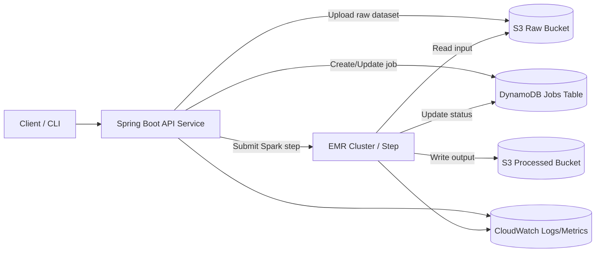

# Architecture (MVP)

This diagram represents the MVP flow. It intentionally prioritizes clarity over completeness.

### Note

For MVP, job status updates can be driven either by:

 - The Spark job writing status back to DynamoDB, or

 - A lightweight polling/step-tracking mechanism in the API service.

Authentication is intentionally excluded from MVP to maintain momentum.