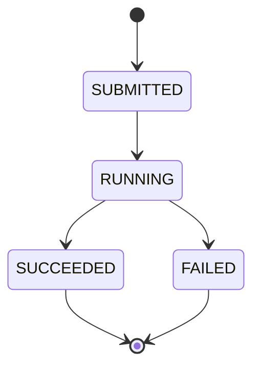

# System Invariants & Non-Goals

This document defines the core guarantees and boundaries of the Cloud Data Platform MVP.
It exists to prevent scope creep and accidental over-engineering.

---

## System Invariants (Must Always Hold)

These are architectural truths that should remain valid as the system evolves.

1. The API service is an orchestrator, not a data processor.
   - All heavy computation must occur in Spark jobs, not in the Spring Boot service.

2. The system is cloud-native and stateless at the API layer.
   - The API service must not store job state locally.

3. All datasets are immutable once submitted.
   - Jobs reference S3 object paths, never modify raw input data.

4. Job execution is asynchronous.
   - API calls must never block on Spark job completion.

5. Infrastructure must be reproducible from code.
   - Any manually created cloud resource is considered technical debt.

6. Failure is a normal state.
   - Job failures must be visible and persisted, not hidden.

---

## Job Lifecycle & Status Transitions

Jobs follow a strict state machine to ensure predictable execution and failure handling.

### Valid Status Transitions

### Transition Rules

- **SUBMITTED → RUNNING**: Only valid next state. Job is ready for processing.
- **RUNNING → SUCCEEDED**: Job completed without errors.
- **RUNNING → FAILED**: Job encountered an error during execution.
- **SUCCEEDED / FAILED**: Terminal states. No further transitions allowed.

### Invalid Transitions (Rejected with 400)

- SUBMITTED → SUCCEEDED (must go through RUNNING)
- SUBMITTED → FAILED (must go through RUNNING)
- SUCCEEDED → any state (terminal)
- FAILED → any state (terminal)

### Implementation

Status transitions are validated in `JobStatusTransitionValidator` before being persisted to DynamoDB.
The `updatedAt` timestamp and optional `statusMessage` are updated with each transition.

### Future: Worker Integration

When Spark workers begin reporting job status, they will POST to `/internal/jobs/{jobId}/status`
with the appropriate status update and a descriptive message. The API will validate the transition
and persist the change atomically.

---

## Explicit Non-Goals (For MVP)

The following are intentionally excluded to preserve focus and delivery speed:

- Real-time streaming ingestion
- User-facing UI
- Complex machine learning pipelines
- Cross-region replication and DR
- Multi-tenant isolation
- Fine-grained RBAC
- Autoscaling optimizations

These may be added in later phases.

---

## Design Philosophy

Prefer:

- Simple over clever
- Explicit over implicit
- Boring technology over trendy abstractions
- Working systems over perfect designs
