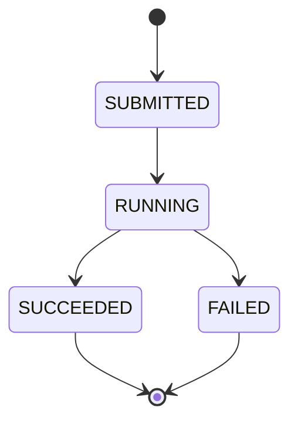

# System Invariants & Non-Goals

This document defines the core guarantees and boundaries of the Cloud Data Platform MVP.
It exists to prevent scope creep and accidental over-engineering.

---

## System Invariants (Must Always Hold)

These are architectural truths that should remain valid as the system evolves.

1. The API service is an orchestrator, not a data processor.
   - All heavy computation must occur in Spark jobs, not in the Spring Boot service.

2. The system is cloud-native and stateless at the API layer.
   - The API service must not store job state locally.

3. All datasets are immutable once submitted.
   - Jobs reference S3 object paths, never modify raw input data.

4. Job execution is asynchronous.
   - API calls must never block on Spark job completion.

5. Infrastructure must be reproducible from code.
   - Any manually created cloud resource is considered technical debt.

6. Failure is a normal state.
   - Job failures must be visible and persisted, not hidden.

---

## Job Lifecycle & Status Transitions

Jobs follow a strict state machine to ensure predictable execution and failure handling.

### Valid Status Transitions

### Transition Rules

- **SUBMITTED → RUNNING**: Only valid next state. Job is ready for processing.
- **RUNNING → SUCCEEDED**: Job completed without errors.
- **RUNNING → FAILED**: Job encountered an error during execution.
- **SUCCEEDED / FAILED**: Terminal states. No further transitions allowed.

### Invalid Transitions (Rejected with 400)

- SUBMITTED → SUCCEEDED (must go through RUNNING)
- SUBMITTED → FAILED (must go through RUNNING)
- SUCCEEDED → any state (terminal)
- FAILED → any state (terminal)

### Implementation

Status transitions are validated in `JobStatusTransitionValidator` before being persisted to DynamoDB.
The `updatedAt` timestamp and optional `statusMessage` are updated with each transition.

### Future: Worker Integration

When Spark workers begin reporting job status, they will POST to `/internal/jobs/{jobId}/status`
with the appropriate status update and a descriptive message. The API will validate the transition
and persist the change atomically.

### Nice to haves

- API & Contracts
   - AuthN/Z (OIDC/JWT), rate limiting, request validation, idempotency keys, pagination tokens with opaque cursors.
   - Error contracts and correlation IDs in responses/logs.
- Job Orchestration
   - Worker callbacks with signed requests; retry/backoff; DLQ for failed callbacks.
   - Job timeouts and cancellation semantics.
   - Status audit trail (who/when changed state) beyond current status fields.
- Data Pipeline
   - Output manifest/index for processed artifacts; checksums for integrity.
   - Schema/versioning for inputs and outputs; basic validation before enqueue.
   - Quotas per user/tenant (future multi-tenancy).
- Reliability & Ops
   - Structured logging with trace/span IDs; log redaction.
   - Metrics: request latencies, DynamoDB/S3/EMR calls, job lifecycle durations.
   - Alarms: 5xx rates, WAF findings, DynamoDB throttles, EMR step failures.
   - Runbooks for common failures (upload failures, job stuck RUNNING, EMR step retries).
- Security
   - IAM least-privilege review; split roles for control plane vs. data plane.
   - WAF to BLOCK mode in prod; custom rules (path allowlist, geo/rate tuning).
   - S3 object encryption KMS, bucket key usage; deny public access (already set).
   - Signed worker callbacks; audit logging for status changes.
- Cost & Scaling
   - DynamoDB autoscaling / RCUs+WCUs alarms; GSI capacity alarms.
   - S3 storage class transitions for processed artifacts; tighter lifecycle policies.
   - EMR right-sizing/spot; per-step vs. cluster reuse comparison.
   - ECS scaling policies (CPU/latency-based); task count floor/ceiling.
- DX & Tooling
   - Local dev data fixtures; smoke tests hitting /jobs and /internal/jobs.
   - Postman/Insomnia collection; OpenAPI examples.
   - CI: integration tests with LocalStack for S3/DDB; contract tests for status transitions.
- Data Governance
   - PII scanning on uploads; tagging datasets/jobs; retention policies per dataset type.
   - Access logging (S3 server access logs / CloudTrail data events) for audits.
- Performance
   - Bulk listing with consistent pagination; secondary indexes for filtering by status.
   - Caching presigned URL generation limits; request shaping on upload endpoints.
---

## Explicit Non-Goals (For MVP)

The following are intentionally excluded to preserve focus and delivery speed:

- Real-time streaming ingestion
- User-facing UI
- Complex machine learning pipelines
- Cross-region replication and DR
- Multi-tenant isolation
- Fine-grained RBAC
- Autoscaling optimizations

These may be added in later phases.

---

## Design Philosophy

Prefer:

- Simple over clever
- Explicit over implicit
- Boring technology over trendy abstractions
- Working systems over perfect designs

### Configuration & Environment Variables

The backend service requires the following environment variables in production:

**AWS & Storage:**
- `AWS_REGION`: AWS region (default: `us-east-1`)
- `RAW_BUCKET`: S3 bucket for raw input data (default: `cloud-data-platform-dev-raw`)
- `PROCESSED_BUCKET`: S3 bucket for processed output (default: `cloud-data-platform-dev-processed`)
- `JOBS_TABLE`: DynamoDB table for job metadata (default: `cloud-data-platform-dev-jobs`)

**EMR Serverless:**
- `EMR_APPLICATION_ID`: EMR Serverless application ID (required in production, empty default for local/CI)
- `EMR_JOB_ROLE_ARN`: IAM role ARN for EMR job execution (required in production, empty default for local/CI)

**Local Development & CI:**
All variables have safe defaults in `application.yml` to allow `./gradlew clean build` and test execution without AWS credentials.
In ECS/production, these are injected via task environment variables.

**Spark Job Execution:**
- `SPARK_JAR_PATH`: S3 path to compiled Spark job JAR (default: `s3://cloud-data-platform-dev-raw/jars/cloud-data-platform-spark-jobs-0.1.0.jar`)

All EMR and Spark configuration defaults enable local builds and CI test execution without AWS credentials.
Production deployments override these via ECS task environment variables.